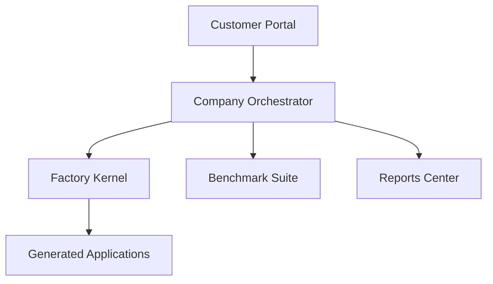

# Architecture Diagram

```mermaid
flowchart TD
  A["Customer Portal"] --> B["Company Orchestrator"]
  B --> C["Factory Kernel"]
  B --> D["Benchmark Suite"]
  B --> E["Reports Center"]
  C --> F["Generated Applications"]
```