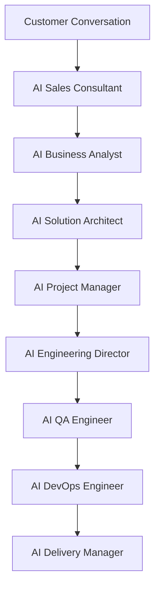

# Architecture Report

## Department Diagram

## Artifact Flow

- Proposal
- Business Analysis
- Architecture
- Sprint Plan
- Capability Composition
- Software Generation
- Testing
- Deployment
- Delivery

## Capability Usage

- authentication
- users
- roles
- permissions
- dashboard
- notifications
- audit-logs
- email
- file-storage
- settings
- search
- reports
- health
- version
- logging
- crm
- invoices
- pos

## Platform Readiness

- ready

## Commercial Readiness

- ready

## Remaining Technical Debt

- Production credentials must be supplied by the deployment environment.
- Domain-specific workflows can be expanded in later releases.

## Recommended V8 Roadmap

- Expand automation coverage
- Add multi-tenant controls
- Add analytics and reporting hardening
- Introduce role-based feature flags
